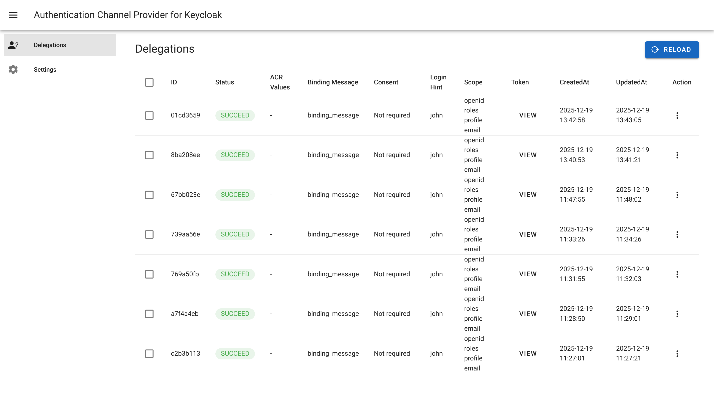
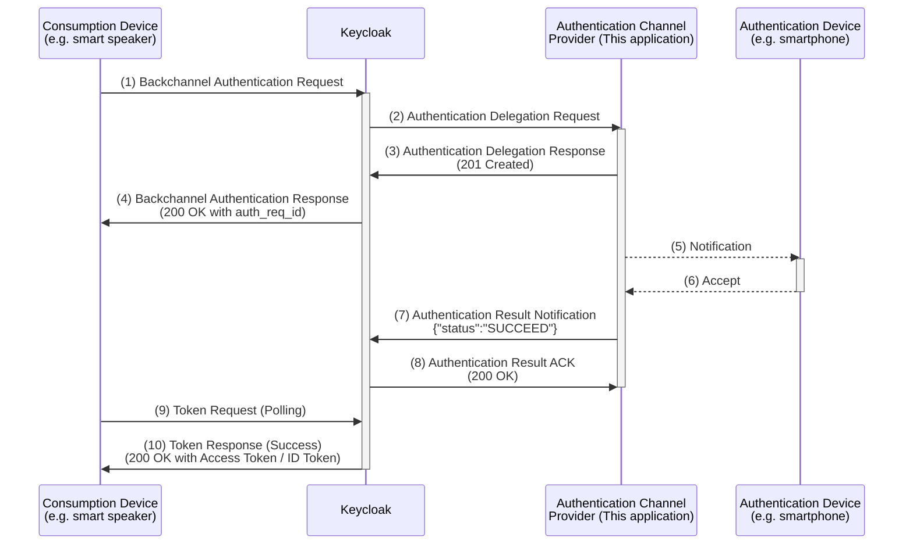
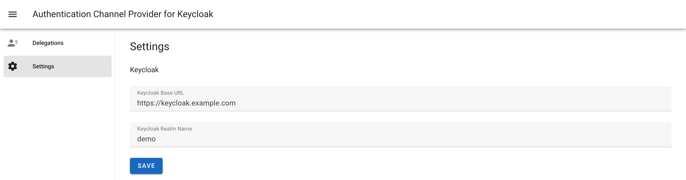
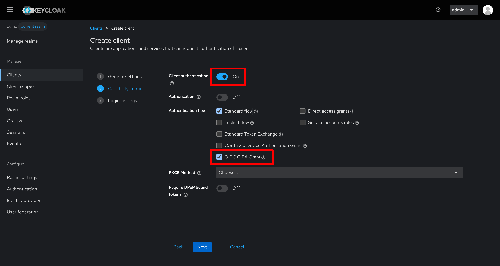

# Example Authentication Channel Provider for Keycloak CIBA

[English](./README.md) | 日本語

## 概要

KeycloakでClient-Initiated Backchannel Authentication (CIBA) を試す際に利用できる、Authentication Channel Providerとして振る舞うWebアプリケーションです。Keycloakから受け取ったAuthentication Delegation Requestに対して、Web画面から許可を返答することができます。



CIBAでアクセストークンを取得する正常系のフローは次の通りです。このアプリケーションでは下記(5)(6)のフローは実装されておらず、Web画面にアクセスして許可する仕様になっています。



## 前提条件

### 動作確認済みバージョン

このアプリケーションは以下のバージョンにて動作を確認しています。

- Go: 1.25.5
- Node.js: 24.3.0
- pnpm: 10.25.0
- Docker: 28.4.0
- Keycloak: 26.3.2

### ネットワーク要件

- Keycloakからこのアプリケーション（デフォルト：3000番ポート）へHTTPリクエストが到達できること。
- このアプリケーションからKeycloakのエンドポイントへHTTPリクエストが到達できること。

## 使い方

### アプリケーションの実行方法

フロントエンドはVue.js + Vuetify、バックエンドはGolangで書かれています。次のコマンドで実行バイナリが作成されます。Linux / amd64 以外の環境向けにビルドしたい場合は、Makefileの `GOOS` / `GOARCH` / `GOAMD64` を調整してください。

```bash
make
```

バイナリができたら直接実行できます。環境変数や引数の設定はありません。データはSQLiteで管理するため `delegator.db` が作成されます。

```bash
./delegator
```

または、Docker Composeを利用することもできます。

```bash
docker compose build
docker compose up -d
```

### アプリケーションの初期設定

アプリケーションが起動したら、 http://localhost:3000/ にアクセスすると管理画面が表示されます。Settingsページから、KeycloakのベースURLとレルム名を指定し、保存してください。




## Keycloakの設定

### 環境変数の設定

Keycloakでは、Authentication Channel ProviderへのDelegationリクエスト先を環境変数で指定できます。環境変数 `KC_SPI_CIBA_AUTH_CHANNEL_CIBA_HTTP_AUTH_CHANNEL_HTTP_AUTHENTICATION_CHANNEL_URI` に、このアプリケーションの `/api/delegations` に向けたURL指定してください。

### クライアントの設定

Keycloakでクライアントを作成する際、「Client authentication」を有効化してください。また、Authentication flowから「OIDC CIBA Grant」を有効化してください。



## 参考URL

- [OpenID Connect Client-Initiated Backchannel Authentication Flow - Core 1.0](https://openid.net/specs/openid-client-initiated-backchannel-authentication-core-1_0.html)
- [Server Administration Guide (Keycloak)](https://www.keycloak.org/docs/latest/server_admin/index.html)
