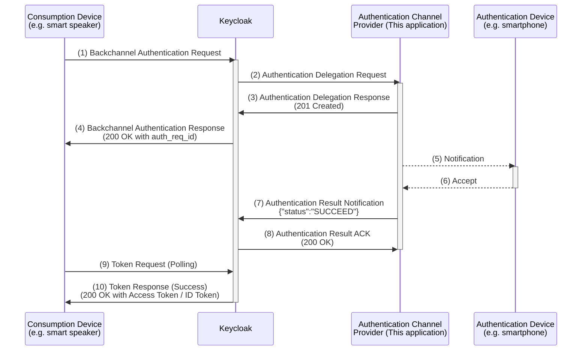

# Example Authentication Channel Provider for Keycloak CIBA

English | [日本語](./README.ja.md)

## Overview

This is a web application that acts as an Authentication Channel Provider for testing Client-Initiated Backchannel Authentication (CIBA) with Keycloak. It allows you to respond to "Authentication Delegation Requests" received from Keycloak by manually approving them through a web interface.


The standard flow for obtaining an access token via CIBA is as follows. In this specific application, steps (5) and (6) are not implemented as an automated background process; instead, the user interacts with the web UI to grant permission.



## Prerequisites

### Verified Versions

This application has been verified to work with the following versions:

- Go: 1.25.5
- Node.js: 24.3.0
- pnpm: 10.25.0
- Docker: 28.4.0
- Keycloak: 26.3.2

### Network Requirements

- Keycloak must be able to reach this application via HTTP requests (default port: `3000`).
- This application must be able to reach Keycloak endpoints via HTTP requests.

## Usage

### How to Run the Application

The frontend is built with Vue.js + Vuetify, and the backend is written in Golang. You can generate the executable binary using the following command. If you need to build for environments other than Linux / amd64, please adjust `GOOS`, `GOARCH`, and `GOAMD64` in the Makefile.

```bash
make
```

Once the binary is created, you can run it directly. No environment variables or arguments are required for the initial launch. Since data is managed via SQLite, a file named `delegator.db` will be created automatically.

```bash
./delegator
```

Alternatively, you can use Docker Compose:

```bash
docker compose build
docker compose up -d
```

### Initial Application Setup

After starting the application, access http://localhost:3000/ to open the management console. Go to the Settings page, enter your Keycloak Base URL and Realm name, and save the configuration.


## Keycloak Configuration

### Environment Variables

In Keycloak, you can specify the endpoint for delegation requests to the Authentication Channel Provider via environment variables. Set the following variable to the URL of this application's `/api/delegations` endpoint:

`KC_SPI_CIBA_AUTH_CHANNEL_CIBA_HTTP_AUTH_CHANNEL_HTTP_AUTHENTICATION_CHANNEL_URI`

### Client Settings

When creating a client in Keycloak, ensure that "Client authentication" is enabled. Additionally, enable the "OIDC CIBA Grant" under the Authentication flow settings.


## References

- [OpenID Connect Client-Initiated Backchannel Authentication Flow - Core 1.0](https://openid.net/specs/openid-client-initiated-backchannel-authentication-core-1_0.html)
- [Server Administration Guide (Keycloak)](https://www.keycloak.org/docs/latest/server_admin/index.html)
